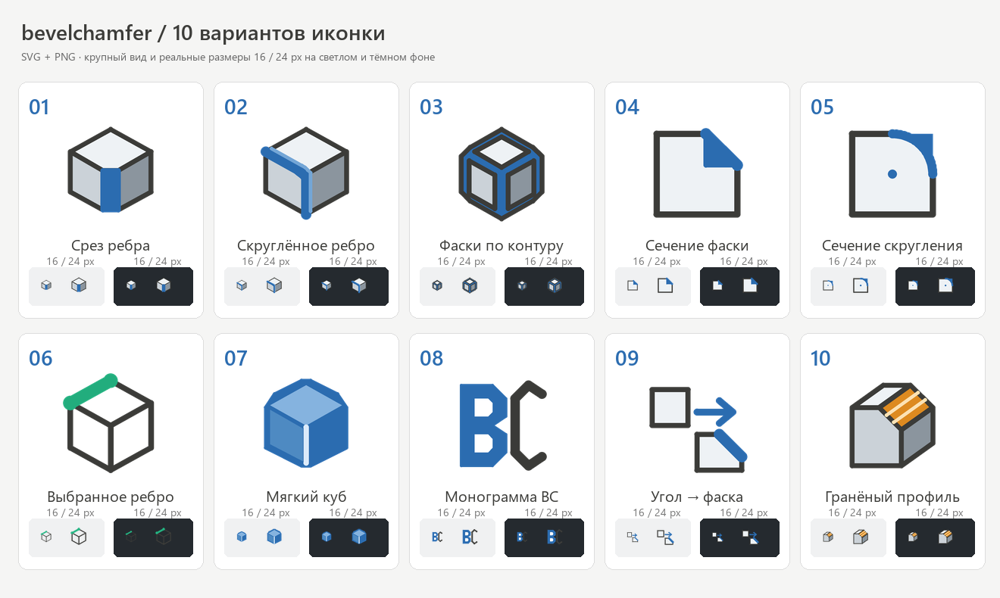

# Варианты иконки bevelchamfer

Текущая иконка плагина не заменена. Все SVG имеют прозрачный фон и viewBox 24×24; PNG подготовлены в размерах 16, 24 и 256 px.

1. **Срез ребра** — [SVG](icon-01.svg), [PNG 256](icon-01-256.png).
2. **Скруглённое ребро** — [SVG](icon-02.svg), [PNG 256](icon-02-256.png).
3. **Фаски по контуру** — [SVG](icon-03.svg), [PNG 256](icon-03-256.png).
4. **Сечение фаски** — [SVG](icon-04.svg), [PNG 256](icon-04-256.png).
5. **Сечение скругления** — [SVG](icon-05.svg), [PNG 256](icon-05-256.png).
6. **Выбранное ребро** — [SVG](icon-06.svg), [PNG 256](icon-06-256.png).
7. **Мягкий куб** — [SVG](icon-07.svg), [PNG 256](icon-07-256.png).
8. **Монограмма BC** — [SVG](icon-08.svg), [PNG 256](icon-08-256.png).
9. **Угол → фаска** — [SVG](icon-09.svg), [PNG 256](icon-09-256.png).
10. **Гранёный профиль** — [SVG](icon-10.svg), [PNG 256](icon-10-256.png).

Генератор `generate.py` создаёт SVG, PNG и лист обзора из общих геометрических примитивов.
